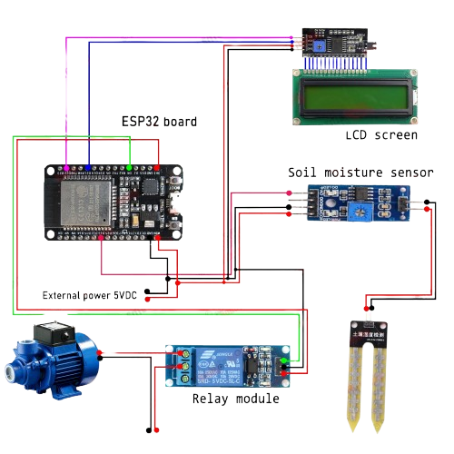

# 🌿 IoT-Based Smart Garden Irrigation System with Real-Time Monitoring Using Blynk App

This project implements a **smart irrigation system** using an **ESP32 microcontroller**, **soil moisture sensor**, and **Blynk IoT app**. It monitors real-time soil conditions and automatically turns on/off a water pump based on moisture levels. It also allows users to manually control the irrigation system and get live data updates on their smartphones.

---

## 🧠 Features

- 🌱 **Soil Moisture Monitoring**
- 💧 **Automatic Pump Activation**
- 📲 **Manual Control via Blynk App**
- 📊 **Real-Time Sensor Data Monitoring**
- 🌐 **Wi-Fi Connectivity using ESP32**
- 🔔 **Remote Notification & Updates**

---

## 🔧 Hardware Requirements

- ✅ ESP32 Development Board  
- ✅ Soil Moisture Sensor  
- ✅ Relay Module  
- ✅ Mini Water Pump  
- ✅ Jumper Wires  
- ✅ Power Supply  
- ✅ Breadboard  

---

## 📱 Software Requirements

- Arduino IDE  
- Blynk IoT App (iOS/Android)  
- Blynk Libraries (`BlynkSimpleEsp32.h`, `WiFi.h`)  
- Blynk Auth Token  

---

## 🔌 Circuit Diagram

The following diagram shows the wiring between ESP32, soil moisture sensor, relay, and water pump:




---

📲 Blynk App Configuration
Create a new project and select ESP32

Add the following widgets:

Gauge (linked to V0) – shows soil moisture

Value Display (linked to V1) – shows pump status

Button (optional) – manual control

Enter your Auth Token in the code

📈 Project Applications
Home Gardening 🌼

Agricultural Fields 🌾

Smart City Projects 🌆

Water Conservation Projects 💧

📌 Future Enhancements
Add Temperature & Humidity Sensors

Connect to Google Sheets or Firebase

Send email/SMS alerts

Use solar power for eco-friendliness ☀️


## 👨‍💻 Developed By

**Md. Junayed Bin Karim**  
Department of Computer Science & Engineering (CSE)  
[Daffodil International University](https://daffodilvarsity.edu.bd)  
📍 Bangladesh  

- 🔗 GitHub: [@Junayed-Bin-Karim](https://github.com/Junayed-Bin-Karim)  
- 💼 LinkedIn: [Junayed Bin Karim](https://www.linkedin.com/in/junayed-bin-karim-47b755270/)  


## 🧾 Code Overview


```cpp
#define BLYNK_PRINT Serial
#include <WiFi.h>
#include <WiFiClient.h>
#include <BlynkSimpleEsp32.h>

char auth[] = "YourAuthToken";      // Blynk Auth Token
char ssid[] = "YourWiFiSSID";       // WiFi Name
char pass[] = "YourWiFiPassword";   // WiFi Password

int moisturePin = 34;               // Analog pin for soil sensor
int relayPin = 25;                  // GPIO pin for pump relay

void setup() {
  Serial.begin(9600);
  pinMode(relayPin, OUTPUT);
  digitalWrite(relayPin, HIGH);     // Pump OFF initially

  Blynk.begin(auth, ssid, pass, "blynk.cloud", 80);
}

void loop() {
  Blynk.run();

  int moisture = analogRead(moisturePin);
  Serial.print("Soil Moisture: ");
  Serial.println(moisture);

  if (moisture < 1000) {            // Adjust threshold as needed
    digitalWrite(relayPin, LOW);    // Turn ON pump
    Blynk.virtualWrite(V1, "Pump ON");
  } else {
    digitalWrite(relayPin, HIGH);   // Turn OFF pump
    Blynk.virtualWrite(V1, "Pump OFF");
  }

  Blynk.virtualWrite(V0, moisture); // Send data to Blynk
  delay(2000);
}


